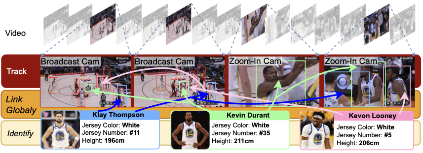
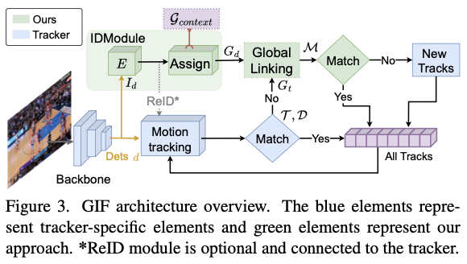
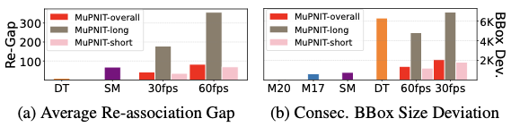
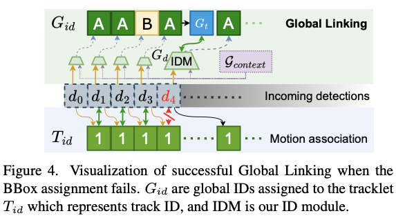
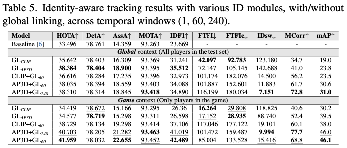
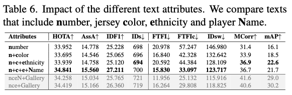
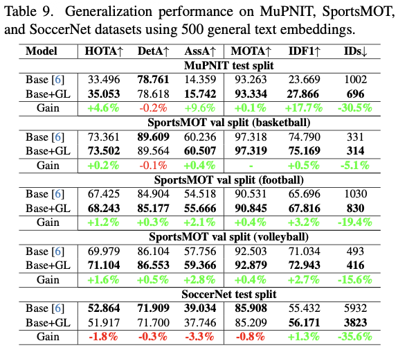
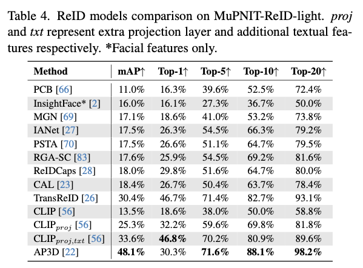
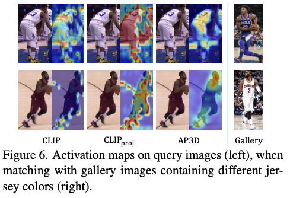
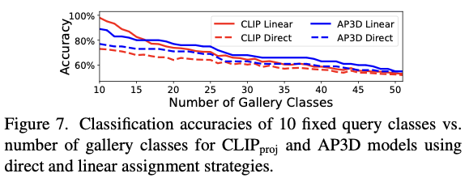

# GIF: Advancing Player Identification and Tracking with Global ID Fusion

**Official repository** for the paper *"Advancing Player Identification and Tracking with Global ID Fusion (GIF)"*, published at **WACV 2026 (Oral)**.

Karol Wojtulewicz\*, Minxing Liu\*, Niklas Carlsson — Link&ouml;ping University, Sweden

<p align="center">
  
</p>

GIF is a modular, online framework for identity-consistent multi-object tracking in sports. It combines a motion-based tracker with a global ID module and global linking to maintain player identities across camera switches, occlusions, and long temporal gaps — achieving state-of-the-art results, improving HOTA by 25.3% and IDF1 by 79.5% over OC-SORT.

<p align="center">
  
</p>

## Repository Structure

```
GIF/
├── reid/                        # Player re-identification benchmarks
│   ├── mupnit_clip_reid/        #   CLIP-based ReID (image + text embeddings)
│   └── AP3D/                    #   Video-based ReID with 3D convolutions
│
├── trackers/                    # OC-SORT multi-object tracker
│   ├── ocsort_tracker/          #   Core tracker with ReID support
│   └── tracking_utils/          #   I/O, evaluation, timing utilities
│
├── yolox/                       # YOLOX detection framework
│   ├── models/                  #   YOLOX-X architecture (CSPDarknet + PAFPN)
│   ├── data/                    #   Dataset loading and augmentation
│   ├── evaluators/              #   MuPNIT MOT evaluator with ReID
│   ├── exp/                     #   Experiment configuration base classes
│   ├── core/                    #   Training launcher
│   └── utils/                   #   Utilities
│
├── tools/
│   ├── run_ocsort_mupnit_ReID.py   # Run OC-SORT tracking + evaluation on MuPNIT
│   ├── train.py                    # Train YOLOX detector
│   ├── demo_track_ocsortGL.py      # Demo: generate annotated video with player IDs
│   └── demo_track_text.py          # Demo: CLIP text-based attribute classification
│
├── exps/example/mot/
│   └── yolox_x_mupnit.py       # YOLOX-X experiment config for MuPNIT
│
├── TrackIDEval/                 # HOTA, CLEAR, Identity, GlobalID metrics evaluation
├── clip_reid/                   # CLIP ReID inference wrapper (used by tracker)
├── ap3d_reid/                   # AP3D ReID inference wrapper (used by tracker)
├── motmetrics/                  # MOT evaluation metrics (MOTA, IDF1, etc.)
└── utils/                       # Argument parsing and utilities
```

## Installation

### Prerequisites

- Python >= 3.6
- PyTorch >= 1.7
- CUDA-compatible GPU

### Setup

```bash
# Create conda environment
conda create -n OCSort python=3.8
conda activate OCSort

# Install dependencies
pip install -r requirements.txt

# Install YOLOX
python setup.py develop

# Install additional dependencies
pip install cython
pip install 'git+https://github.com/cocodataset/cocoapi.git#subdirectory=PythonAPI'
pip install cython_bbox
```

## Training the YOLOX Detector

Training follows the [ByteTrack](https://github.com/ifzhang/ByteTrack) approach. OC-SORT can work with any detector, but we use YOLOX-X for best performance.

### 1. Download pretrained weights

Download the COCO-pretrained YOLOX-X weight from the [YOLOX model zoo](https://github.com/Megvii-BaseDetection/YOLOX/tree/0.1.0) and place it in a `pretrained/` directory:

```bash
mkdir pretrained
# Download yolox_x.pth into pretrained/
```

### 2. Prepare the MuPNIT dataset

> **Dataset access:** The MuPNIT and MuPNIT-ReID datasets are not publicly hosted. If you would like access to the datasets, please contact us.

<p align="center">
  
  <br><em>MuPNIT shows the largest re-association gap and bounding box size deviation compared to existing MOT datasets.</em>
</p>

Set the environment variable to point to the dataset root:

```bash
export MUPNIT_DATASET_ROOT=/path/to/MuPNIT_30fps_global
```

The MuPNIT dataset should be in MOT format with the following structure:

```
MuPNIT_30fps_global/
├── annotations/
│   ├── train.json                # COCO-format training annotations
│   ├── val.json                  # COCO-format validation annotations
│   └── test.json                 # COCO-format test annotations
├── train/                        # Training sequences
│   └── <video_id>/
│       ├── img1/                 # Frame images
│       ├── gt/gt.txt             # Ground truth annotations
│       └── seqinfo.ini           # Sequence metadata
├── val/                          # Validation sequences
│   └── <video_id>/
│       ├── img1/
│       ├── gt/gt.txt
│       └── seqinfo.ini
└── test/                         # Test sequences (no ground truth)
    └── <video_id>/
        ├── img1/
        └── seqinfo.ini
```

### 3. Train

```bash
python tools/train.py \
    -f exps/example/mot/yolox_x_mupnit.py \
    -d <num_gpus> \
    -b <batch_size> \
    --fp16 \
    -o \
    -c pretrained/yolox_x.pth
```

**Example** (8 GPUs, batch size 48):
```bash
python tools/train.py -f exps/example/mot/yolox_x_mupnit.py -d 8 -b 48 --fp16 -o -c pretrained/yolox_x.pth
```

Training outputs (checkpoints, logs) will be saved to `YOLOX_outputs/`.

## Running OC-SORT Tracking + Evaluation

<p align="center">
  
</p>

### Tracking only (no player identification)

```bash
python tools/run_ocsort_mupnit_ReID.py \
    -f exps/example/mot/yolox_x_mupnit.py \
    -c <path-to-checkpoint>/best_ckpt.pth.tar \
    -b 1 -d 1 \
    --fp16 --fuse \
    --track_thresh 0.4 \
    --expn MuPNIT_ReID \
    --only_eval \
    --yolo_model yolox_x \
    --mupnit
```

### Tracking + Player Identification (with ReID)

```bash
python tools/run_ocsort_mupnit_ReID.py \
    -f exps/example/mot/yolox_x_mupnit.py \
    -c <path-to-checkpoint>/best_ckpt.pth.tar \
    -b 1 -d 1 \
    --fp16 --fuse \
    --track_thresh 0.4 \
    --expn MuPNIT_ReID_ID \
    --only_eval \
    --yolo_model yolox_x \
    --mupnit \
    --id_level game \
    --reid_thresh 0.0 \
    --use_gallery \
    --gallery_path <path-to-gallery-embeddings>/gallery_test \
    --text_path <path-to-text-embeddings>/test
```

### Key tracking parameters

| Parameter | Default | Description |
|-----------|---------|-------------|
| `--track_thresh` | 0.6 | Detection confidence threshold for tracking |
| `--iou_thresh` | 0.3 | IoU threshold for association matching |
| `--min_hits` | 3 | Minimum detections before track is confirmed |
| `--track_buffer` | 30 | Frames to keep lost tracks alive |
| `--inertia` | 0.2 | Velocity direction consistency weight |
| `--reid_thresh` | 0.5 | ReID matching threshold |
| `--id_level` | global | Identification scope: `global` or `game` |
| `--feature_extractor` | CLIP | ReID model: `CLIP` or `ap3d` |

## Evaluation Metrics

### MOT Metrics (via motmetrics)

The run script automatically computes standard MOT metrics:
MOTA, IDF1, MOTP, MT/ML, FP/FN, ID Switches, and Fragmentations.

### TrackIDEval Metrics

TrackIDEval extends the [TrackEval](https://github.com/JonathonLuiten/TrackEval) framework with custom metrics for player identification evaluation.

#### Introduced metrics

**GlobalIDMetrics** — Evaluates how well the tracker assigns correct player identities to tracklets:

| Sub-metric | Description |
|------------|-------------|
| **FTFI** | Frames-to-first-identification — number of frames from track start until the tracker settles on its majority-vote predicted class |
| **FTFIc** | Frames-to-first-*correct*-identification — number of frames from track start until the predicted class matches the ground-truth majority class |
| **AvgClsSw** | Average class switches — how often a track's predicted player identity changes during its lifetime |
| **MCorrRat** | Mean correct ratio — average fraction of frames where the predicted class equals the track's predicted majority |
| **mAP** | Overall ratio of correctly identified frames (predicted class = GT majority) across all tracklets |
| **NDTPC** | Number of different tracklets per class — measures identity fragmentation: how many tracklets end up assigned to each GT player |

**IDEucl** — Euclidean distance-based identity metric. Instead of counting ID matches per frame, it computes centroid trajectories for GT and tracker detections, uses Hungarian assignment to optimally match tracklets to GT tracks based on total distance covered, and reports the ratio of matched tracker distance to GT distance. Measures identity consistency through spatial trajectory coherence.

#### Standard metrics (from TrackEval)

| Metric | Key Sub-metrics | Description |
|--------|----------------|-------------|
| **HOTA** | HOTA, DetA, AssA, DetRe, DetPr, AssRe, AssPr, LocA | Higher Order Tracking Accuracy — balances detection and association |
| **CLEAR** | MOTA, MOTP, MODA, CLR_Re, CLR_Pr, MTR, MLR, sMOTA, IDSW, Frag | Classic MOT metrics |
| **Identity** | IDF1, IDR, IDP, IDTP, IDFN, IDFP | Identity-aware tracking metrics |
| **VACE** | STDA, ATA, FDA, SFDA | Video Annotation Computing Ensemble |
| **Count** | Dets, GT_Dets, IDs, GT_IDs | Detection and identity counters |
| **TrackMAP** | AP_all, AR_all (with area splits s/m/l) | Mean Average Precision for tracking |
| **JAndF** | J-Mean, J-Recall, F-Mean, F-Recall, J&F | Segmentation-based tracking (Jaccard & contour) |

#### Running TrackIDEval

Run after generating tracking results:

```bash
python TrackIDEval/scripts/run_mot_challenge.py \
    --SPLIT_TO_EVAL test \
    --METRICS HOTA CLEAR Identity GlobalIDMetrics \
    --GT_FOLDER $MUPNIT_DATASET_ROOT \
    --SKIP_SPLIT_FOL True \
    --TRACKERS_TO_EVAL <path-to-YOLOX_outputs>/MuPNIT_ReID \
    --TRACKER_SUB_FOLDER MuPNIT_ReID_val \
    --PLOT_CURVES False \
    --TRACKERS_FOLDER "" \
    --SEQMAP_FILE $MUPNIT_DATASET_ROOT/seqmap_test.txt
```

Select any combination of metrics via the `--METRICS` flag (e.g., `--METRICS HOTA CLEAR Identity GlobalIDMetrics VACE IDEucl`).

### Results

<p align="center">
  
  <br><em>Identity-aware tracking results with various ID modules, with/without global linking.</em>
</p>

<p align="center">
  
  <br><em>Impact of different text attributes on identification performance.</em>
</p>

<p align="center">
  
  <br><em>Generalization performance on MuPNIT, SportsMOT, and SoccerNet.</em>
</p>

## Demo: Generating Annotated Videos

### Player identification demo

Generates a video with bounding boxes and player name labels:

```bash
python tools/demo_track_ocsortGL.py \
    -f exps/example/mot/yolox_x_mupnit.py \
    -c <path-to-checkpoint>/best_ckpt.pth.tar \
    --demo_type video \
    --path demo_videos/<input-video>.mp4 \
    --out_path demo_videos/demo_out.mp4 \
    --save_result \
    --fp16 --fuse \
    --track_thresh 0.4 \
    --yolo_model yolox_x \
    --mupnit \
    --id_level game \
    --feature_extractor CLIP \
    --reid_thresh 0.5 \
    --average_query_embeds 240 \
    --use_global_linking \
    --use_gallery \
    --gallery_path <path-to-gallery-embeddings>/gallery_test \
    --text_path <path-to-text-embeddings>/test \
    --players_info_file <path-to-player-descriptions>.json \
    --video_name <game-id>
```

### CLIP text attribute classification demo

Classifies player attributes (jersey number, jersey color, ethnicity) using CLIP text embeddings:

```bash
python tools/demo_track_text.py \
    --demo_type video \
    -f exps/example/mot/yolox_x_mupnit.py \
    -c <path-to-checkpoint>/best_ckpt.pth.tar \
    --path demo_videos/<input-video>.mp4 \
    --out_path demo_videos/demo_text_out.mp4 \
    --save_result \
    --fp16 --fuse \
    --rosters_file <path-to-rosters>.json
```

## ReID Benchmarks

See the `reid/` directory for player re-identification benchmarks:

- **`reid/mupnit_clip_reid/`** — CLIP-based ReID with three settings: baseline, projection layer, and text fusion
- **`reid/AP3D/`** — Video-based ReID using Appearance-Preserving 3D Convolutions

<p align="center">
  
  <br><em>ReID models comparison on MuPNIT-ReID-light.</em>
</p>

<p align="center">
  
  <br><em>Activation maps on query images when matching with gallery images containing different jersey colors.</em>
</p>

<p align="center">
  
  <br><em>Classification accuracy vs. number of gallery classes for CLIP and AP3D models.</em>
</p>

## Citation

If you use this code in your research, please cite:

```bibtex
@inproceedings{gif2026wacv,
  title={Advancing Player Identification and Tracking with Global ID Fusion},
  booktitle={IEEE/CVF Winter Conference on Applications of Computer Vision (WACV)},
  year={2026}
}
```

## References

- **OC-SORT**: Cao et al., "Observation-Centric SORT: Rethinking SORT for Robust Multi-Object Tracking", CVPR 2023. [arXiv:2203.14360](https://arxiv.org/abs/2203.14360)
- **ByteTrack**: Zhang et al., "ByteTrack: Multi-Object Tracking by Associating Every Detection Box", ECCV 2022.
- **YOLOX**: Ge et al., "YOLOX: Exceeding YOLO Series in 2021".
